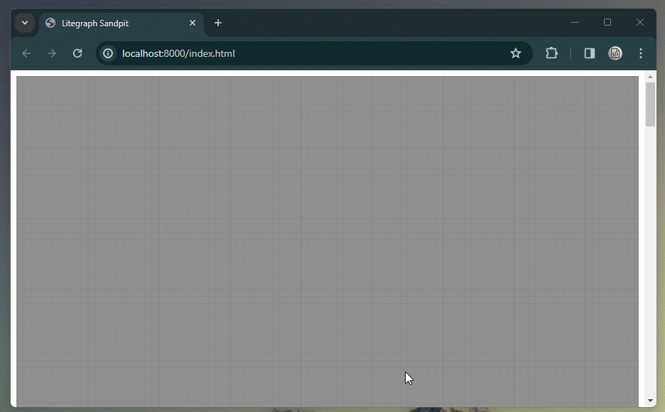

# Litegraph - Port Property Duality

This is a small example project to show the modifications to litegraph to allow port property duality as shown below.



## Getting started

### Prerequisite

You must have both Git and Node.js installed on your computer.

### Clone

First clone this repo to your local computer.

```
git clone https://github.com/benhar-dev/litegraph-port-property-duality.git
```

### Install all of the required dependency, including litegraph

Execute the following command inside the root of the new folder.

```
npm run setup
```

### Start the server

Execute the following command to start the development server.

```
npm start
```

You can now view the live site by navigating to "http://127.0.0.1:8000/index.html" (this should have already auto-started)

## Developing

You can now modify the javascript files in src and the webpage will automatically rebuild and reload on save.

### sandpit-nodepack.js

This is where you will write your new nodes.

### sandpit-desktop-view.js

This mimics the standard desktop-view javascript in the application. You can modify as required.
